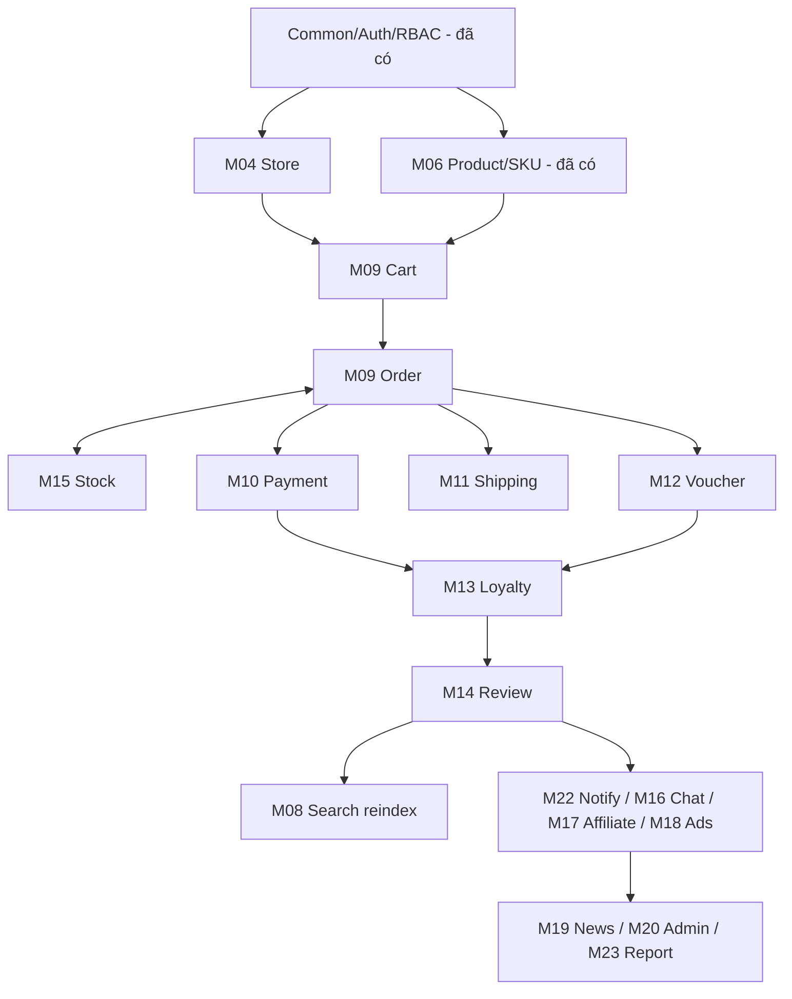

# Kế hoạch triển khai GocGac — Hoàn thiện dự án

| | |
|---|---|
| **Phiên bản** | 1.0 |
| **Ngày** | 13/06/2026 |
| **Mô hình** | Agile — Sprint 2 tuần |
| **Tổng thời lượng dự kiến** | ~14 sprint (≈ 7 tháng / 1 dev; ~3,5 tháng / 2 dev) |

> Dựa trên tài liệu **SRS v1.0**.

---

## 1. Nguyên tắc & quy ước triển khai

### 1.1. Insight: phần lớn nền móng đã có sẵn
Toàn bộ **schema CSDL (≈70 bảng)** và phần lớn **entity JPA** đã được tạo trong các migration `V1–V12`. Với mỗi module còn thiếu, công việc chủ yếu là **xây các tầng phía trên entity**, không phải thiết kế lại CSDL.

### 1.2. Quy trình chuẩn cho MỖI module (Definition of Done)

| # | Bước | Sản phẩm bàn giao |
|---|---|---|
| 1 | Rà soát entity & bảng đã có | Đối chiếu entity với migration, bổ sung cột/enum thiếu. |
| 2 | Repository | Interface JpaRepository + query method/JPQL cần thiết. |
| 3 | DTO | Request (có `@Valid`) + Response; mapping bằng ModelMapper. |
| 4 | Service + nghiệp vụ | Logic, validate, transaction (`@Transactional`), xử lý ngoại lệ. |
| 5 | Controller | REST endpoint + `@PreAuthorize` phân quyền theo SRS. |
| 6 | Bảo mật | Cập nhật SecurityConfig nếu cần (public/protected). |
| 7 | Kiểm thử | Unit test service + integration test controller. |
| 8 | Tài liệu | Swagger annotation + cập nhật Postman collection. |

### 1.3. Hạng mục nền tảng dùng chung (làm 1 lần, dùng mọi module)

> Nên hoàn thiện **Sprint 0** trước khi vào nghiệp vụ để mọi module sau đồng nhất.

- **`ApiResponse<T>`** chuẩn hóa (code, message, data) — vỏ phản hồi thống nhất.
- **`GlobalExceptionHandler`** (`@RestControllerAdvice`) — bắt lỗi validate, not-found, business, 401/403.
- **Lớp lỗi nghiệp vụ**: `BusinessException`, `ResourceNotFoundException` + mã lỗi.
- **Phân trang chuẩn**: `PageResponse<T>` (content, page, size, totalElements).
- **Audit**: `BaseEntity` (createdAt/updatedAt/createdBy) + `@EnableJpaAuditing`.
- **Tiện ích `CurrentUser`**: lấy userId/role từ JWT (SecurityContext).
- **Notification + Email service** (M22) — hạ tầng thông báo, dùng cho Order/duyệt.

---

## 2. Tổng quan lộ trình theo Sprint

| Sprint | Trọng tâm | Module | Ưu tiên |
|---|---|---|---|
| S0 | Nền tảng dùng chung + hoàn thiện phần dở | Common, M04, M01 (social/forgot), M07 follow | 🔴 CAO |
| S1 | Giỏ hàng | M09 (cart) | 🔴 CAO |
| S2 | Đặt hàng + Tồn kho | M09 (order) + M15 | 🔴 CAO |
| S3 | Thanh toán | M10 | 🔴 CAO |
| S4 | Vận chuyển | M11 | 🔴 CAO |
| S5 | Voucher & Khuyến mãi | M12 | 🟠 VỪA |
| S6 | Khách hàng thân thiết | M13 | 🟠 VỪA |
| S7 | Đánh giá & nhận xét | M14 | 🟠 VỪA |
| S8 | Thông báo + Tin nhắn | M22 + M16 | 🟠 VỪA |
| S9 | Cá nhân hóa & gợi ý | M08 | 🟢 THẤP |
| S10 | Tiếp thị liên kết | M17 | 🟢 THẤP |
| S11 | Quảng cáo & Banner | M18 | 🟢 THẤP |
| S12 | Tin tức / CMS | M19 | 🟢 THẤP |
| S13 | Quản trị hệ thống | M20 | 🟠 VỪA |
| S14 | Báo cáo & Dashboard + Hoàn thiện | M23 + test/deploy | 🟠 VỪA |

> **⚠️ Đường găng (critical path):** S1 → S2 → S3 → S4. Đây là luồng mua bán cốt lõi; sàn chỉ vận hành thật được sau khi xong 4 sprint này. Ưu tiên tuyệt đối.

---

## 3. Chi tiết từng Sprint

### Sprint 0 — Nền tảng & hoàn thiện phần dở

**Mục tiêu:** Thiết lập hạ tầng dùng chung và đóng các phần đang dở (◐) để không nợ kỹ thuật.

| Task | Chi tiết |
|---|---|
| Common layer | ApiResponse, GlobalExceptionHandler, PageResponse, BaseEntity audit, CurrentUser util. |
| M04 Store CRUD | Hoàn thiện tạo/sửa gian hàng cho SELLER; cấu hình store. |
| M01 Forgot password | Luồng quên mật khẩu qua email (bảng `password_resets`). |
| M01 Social login | Đăng nhập Google (bảng `social_logins`) — tùy chọn. |
| M07 Channel follow | Theo dõi/bỏ theo dõi kênh. |
| M22 Notification hạ tầng | Entity Notification + service gửi + email template. |

**Tiêu chí hoàn thành:** Tất cả API trả về theo ApiResponse thống nhất; lỗi xử lý tập trung; gửi được email/thông báo thử nghiệm.

### Sprint 1 — Giỏ hàng (M09 phần Cart)

**Use case:** UC-M09-01 Thêm vào giỏ · UC-M09-02 Xem/sửa/xóa giỏ.

- Repository: CartRepository, CartItemRepository.
- DTO: AddToCartRequest (variantId, quantity), UpdateCartItemRequest, CartResponse (tổng tiền, danh sách item).
- Service: tự tạo Cart khi user lần đầu; thêm/gộp item theo SKU; kiểm tra tồn kho khả dụng (`available_quantity`); tính tạm tính.
- Controller `/api/cart`: GET, POST item, PUT item/{id}, DELETE item/{id}, DELETE clear.
- Phân quyền: CUSTOMER.

**Tiêu chí hoàn thành:** Khách thêm SKU vào giỏ, sửa số lượng, xóa; giỏ phản ánh đúng giá hiện tại & tồn kho.

### Sprint 2 — Đặt hàng + Tồn kho (M09 Order + M15)

**Use case:** UC-M09-03 Checkout · 05 Xem đơn · 06 Hủy · 07 Xử lý · 08 Lịch sử trạng thái · UC-M15 giữ/trừ tồn.

- Repository: OrderRepository, OrderItemRepository, OrderStatusHistoryRepository, StockTransactionRepository.
- DTO: CheckoutRequest (địa chỉ, paymentMethod, voucherCode?, dùng điểm?), OrderResponse, OrderListItem.
- Service checkout: validate giỏ → tách đơn theo `store_id` → tính subtotal/shippingFee/discount/total → sinh `order_code` → **giữ tồn** (`reserved_quantity += qty`) → ghi StockTransaction(OUT) → tạo Order(PENDING) + OrderItem → ghi OrderStatusHistory → bắn thông báo.
- Vòng đời đơn: PENDING→CONFIRMED→PROCESSING→SHIPPING→DELIVERED; CANCELLED/RETURNED (hoàn tồn).
- Controller: `/api/orders` (customer) + `/api/seller/orders` (xử lý đơn).
- Bảo đảm `@Transactional` + khóa lạc quan/bi quan chống oversell.

**Tiêu chí hoàn thành:** Đặt được đơn từ giỏ, trừ/giữ tồn chính xác, hủy đơn hoàn tồn, người bán chuyển trạng thái có ghi vết.

### Sprint 3 — Thanh toán (M10)

- **Bước 1 — COD trước:** chọn COD → Order CONFIRMED ngay, Payment(PENDING).
- **Bước 2 — Cổng online:** tích hợp 1 cổng (đề xuất VNPay sandbox): tạo URL thanh toán, xử lý **return URL** + **IPN callback**, đối soát chữ ký.
- Service: cập nhật `payment_status`, đồng bộ Order; thất bại → hoàn giữ tồn + CANCELLED.
- UC-M10-04 Hoàn tiền: API admin REFUNDED.
- Controller: `/api/payments`, `/api/payments/vnpay/callback` (public, verify chữ ký).

**Tiêu chí hoàn thành:** Thanh toán COD & 1 cổng online chạy end-to-end ở sandbox; callback cập nhật đúng trạng thái.

### Sprint 4 — Vận chuyển (M11)

- CRUD ShippingProvider (admin).
- Tạo vận đơn khi đơn SHIPPING: ShippingTracking + mã vận đơn; (tùy chọn) tích hợp API GHN/GHTK.
- Cập nhật ShippingEvent (hành trình), đẩy trạng thái về Order.
- API khách theo dõi đơn `/api/orders/{id}/tracking`.
- Tính phí ship cơ bản theo khu vực/khối lượng (cấu hình).

### Sprint 5 — Voucher & Khuyến mãi (M12)

- CRUD Voucher (store), Promotion + PromotionProduct.
- Khách lưu voucher (user_vouchers).
- **Tích hợp vào checkout (S2):** validate điều kiện (min order, hạn, hạng thành viên, usage limit) → tính giảm giá → ghi VoucherUsage + OrderVoucher + tăng usage_count.
- Cron hết hạn voucher/khuyến mãi → EXPIRED.

### Sprint 6 — Khách hàng thân thiết (M13)

- Quản lý LoyaltyConfig (điểm theo sự kiện) & MemberRank (ngưỡng chi tiêu).
- Tích điểm (EARN) khi đơn DELIVERED; đổi điểm (REDEEM) tại checkout.
- Tính/nâng hạng theo tổng chi tiêu → UserRankHistory; gắn quyền lợi (vd voucher riêng hạng).

### Sprint 7 — Đánh giá & nhận xét (M14)

- Viết đánh giá (chỉ khi đã mua — kiểm tra OrderItem), kèm sao/ảnh.
- Kiểm duyệt đánh giá (admin), phản hồi của shop (ReviewReply), đánh dấu hữu ích.
- Cập nhật `rating_average`/`rating_count` sản phẩm + reindex ES.

### Sprint 8 — Thông báo & Tin nhắn (M22 + M16)

- Hoàn thiện Notification: hộp thông báo, đánh dấu đã đọc; bắn ở các sự kiện đơn/duyệt/KM.
- Chat buyer–seller: Conversation + Message, đếm chưa đọc; auto-reply theo từ khóa. (Cân nhắc WebSocket/STOMP cho realtime.)

### Sprint 9 — Cá nhân hóa & gợi ý (M08)

- Ghi user_product_views, user_search_history.
- Sinh product_recommendations (mua kèm / tương tự / theo lượt xem).
- API "gợi ý cho bạn", "sản phẩm liên quan".

### Sprint 10 — Affiliate (M17)

- Đăng ký & duyệt đối tác → sinh mã affiliate.
- Tạo link, ghi click (affiliate_clicks), gắn affiliateCode vào đơn.
- Tính hoa hồng khi đơn hoàn tất; đối soát PENDING→APPROVED→PAID.

### Sprint 11 — Quảng cáo & Banner (M18)

- Tạo & duyệt chiến dịch quảng cáo (ngân sách, CPC, vị trí).
- Ghi click/chuyển đổi, trừ ngân sách, dừng khi hết.
- Quản lý banner trang chủ (lịch hiển thị).

### Sprint 12 — Tin tức / CMS (M19)

- CRUD NewsCategory, NewsArticle (DRAFT/PUBLISHED), đếm lượt xem; làm sạch HTML (OWASP sanitizer).

### Sprint 13 — Quản trị hệ thống (M20)

- SystemConfig (key-value), MenuItem động theo quyền.
- SystemLog (audit) qua AOP/interceptor.
- BackupLog + job sao lưu CSDL định kỳ.
- Hoàn thiện quản lý Permission & gán role cho user (M02).

### Sprint 14 — Báo cáo, Dashboard & Hoàn thiện

- Dashboard admin: người dùng, đơn, doanh thu toàn sàn.
- Báo cáo gian hàng: doanh thu, sản phẩm bán chạy, tồn kho.
- **Hardening:** security review, kiểm thử tải, tối ưu truy vấn/index, hoàn thiện Swagger, viết tài liệu vận hành & triển khai (Docker Compose: app + PG + ES + MinIO + Keycloak).

---

## 4. Sơ đồ phụ thuộc giữa các module

> **Quy tắc thứ tự:** không bắt đầu Voucher/Loyalty/Review trước khi Order chạy ổn; Affiliate phụ thuộc Order hoàn tất; Report làm sau cùng vì cần dữ liệu mọi module.

---

## 5. Rủi ro & biện pháp

| Rủi ro | Ảnh hưởng | Biện pháp |
|---|---|---|
| Oversell (bán quá tồn) khi đặt đồng thời | Cao | Khóa bi quan/lạc quan trên product_variants; transaction giữ tồn nguyên tử. |
| Tích hợp cổng thanh toán phức tạp | Cao | Làm COD trước; cổng online dùng sandbox, tách interface PaymentGateway. |
| Đồng bộ Elasticsearch lệch dữ liệu | Vừa | Reindex sự kiện + job đồng bộ định kỳ; fallback truy vấn DB. |
| Phình to nghiệp vụ đơn (đa gian hàng) | Vừa | Tách order_items theo store ngay từ S2; chuẩn hóa trạng thái. |
| Thiếu test gây hồi quy | Vừa | DoD bắt buộc unit + integration test mỗi module. |

---

## 6. Tiêu chí nghiệm thu tổng thể (MVP có thể bán hàng)

Hoàn thành **S0–S4** = **MVP vận hành thật**: khách đăng ký → tìm sản phẩm → thêm giỏ → đặt hàng → thanh toán (COD/online) → theo dõi vận chuyển → nhận hàng. Các sprint sau tăng chuyển đổi và mở rộng.

---

*— Hết Kế hoạch phát triển GocGac v1.0 —*
